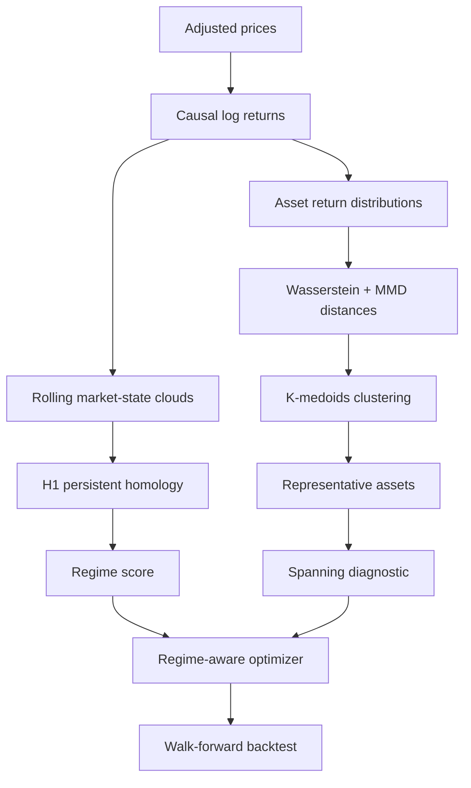

# Topology-Aware Portfolio Optimization

This repository records Brian Hsieh's research project on portfolio construction using persistent homology, Wasserstein geometry, maximum mean discrepancy (MMD), distribution-aware clustering, and regime-aware mean-variance optimization.

The project asks one central question:

> Does persistent market topology plus distribution-aware asset selection produce more stable out-of-sample portfolios than conventional portfolio optimization?

The repository follows the documentation-first structure of the cleanroom CFD + IAFNO project: the executable notebook is preserved, the mathematics is explained separately, the development path is documented, and unvalidated results are not presented as conclusions.

> **Status:** implemented research pipeline; full empirical validation and sensitivity analysis are still in progress. This repository is educational research, not financial advice.

## Current project flow



Persistent homology filters short-lived **topological features**, not raw daily returns. Wasserstein distance and MMD compare full return distributions. The optimizer then uses the selected assets and topological regime score to construct long-only weights under turnover and concentration constraints.

## Development timeline

| Stage | Main development | Status |
|---|---|---|
| PO1 | Efficient frontier and mean-variance spanning study | Studied |
| PO2 | Wasserstein distance for return distributions | Studied |
| PO3 | K-means, MMD, and distribution-aware clustering | Studied |
| PO4 | W-K-means / Wasserstein barycenter direction | Conceptual study |
| PO5 | Persistent homology added as a structural noise and regime branch | Designed |
| PO6 | End-to-end Jupyter research pipeline | Implemented |
| PO7 | Strict walk-forward evaluation with transaction costs and benchmarks | Implemented in code |
| PO8 | Full-period empirical results, ablations, and robustness tests | Pending |

The current notebook contains 34 cells: 16 explanatory Markdown cells and 18 Python cells. Its mathematical notation uses rendered Jupyter/Colab delimiters and defines the objects used by the code.

## Repository contents

- [`notebooks/research`](notebooks/research) — the complete executable Jupyter notebook.
- [`notebooks/PO01.md`](notebooks/PO01.md) — cell-by-cell guide to the current research notebook.
- [`docs/evolution.md`](docs/evolution.md) — development history and the role of each method.
- [`docs/mathematics.md`](docs/mathematics.md) — complete mathematical formulation with GitHub-native rendered equations.
- [`docs/validation-and-limitations.md`](docs/validation-and-limitations.md) — scientific cautions, validation plan, and known limitations.
- [`docs/results.md`](docs/results.md) — result-reporting template; intentionally contains no invented performance claims.
- [`code`](code) — scripts that generate and repair the notebook.
- [`environment`](environment) — installation and reproducibility instructions.
- [`assets/figures`](assets/figures) — destination for exported backtest and topology figures.
- [`ORIGINAL_FILENAMES.md`](ORIGINAL_FILENAMES.md) — source-file manifest and SHA-256 provenance.

## Core methods

### 1. Causal market data

Adjusted prices are converted to log returns. Every rebalance uses only observations strictly before the holding interval.

### 2. Topological regime analysis

Rolling multivariate market states form point clouds. A Vietoris-Rips filtration and first persistent homology identify loop structure across distance scales. Short-persistence loops are treated as topological noise; surviving persistence becomes a causal regime score.

### 3. Distribution-aware asset geometry

Each asset is represented by its trailing empirical return distribution. Pairwise differences combine:

- one-dimensional Wasserstein distance;
- MMD with an RBF kernel.

### 4. Clustering and selection

K-medoids clusters assets using the combined distributional distance matrix. One stable representative is selected from each cluster to reduce redundancy.

### 5. Spanning diagnostic

Long-only efficient frontiers compare a baseline universe with the selected universe. This is an economic frontier diagnostic, not yet a formal Huberman-Kandel spanning test.

### 6. Regime-aware optimization

The optimizer balances estimated return, covariance risk, turnover, and weight limits. Higher topological stress increases risk aversion, covariance shrinkage, and diversification constraints.

### 7. Walk-forward evaluation

The model is compared with:

- conventional all-asset mean-variance optimization;
- equal weighting;
- SPY.

Transaction costs are deducted at each rebalance. Performance is evaluated using CAGR, volatility, Sharpe ratio, Sortino ratio, maximum drawdown, growth of one dollar, and turnover.

## Quick start

### Google Colab

1. Open [`topology_aware_portfolio_optimization.ipynb`](notebooks/research/topology_aware_portfolio_optimization.ipynb).
2. Download the raw notebook.
3. Upload it to Google Colab.
4. Run all cells from top to bottom.
5. Begin with `fast_mode=True`; use `False` only after the complete pipeline runs successfully.

### Local Jupyter

```bash
python -m venv .venv
source .venv/bin/activate
python -m pip install -r environment/requirements.txt
python -m jupyter lab
```

On Windows PowerShell, activate the environment with:

```powershell
.\.venv\Scripts\Activate.ps1
```

## Reproducible outputs

Running the final notebook cells creates `portfolio_outputs/` with:

- `daily_log_returns.csv`;
- `performance_metrics.csv`;
- `full_model_weights.csv`;
- `topology_history.csv`;
- `latest_clusters.csv`.

Generated data and figures should be committed only after the experiment configuration and sample period are recorded.

## Detailed references

- Read [Mathematics and Model Structure](docs/mathematics.md) directly on GitHub for the full rendered formulation.
- Read [Evolution of the Project](docs/evolution.md) for how the current method was assembled.
- Read [Validation and Limitations](docs/validation-and-limitations.md) before interpreting any backtest.
- Read [Notebook PO01](notebooks/PO01.md) for a cell-by-cell execution guide.

## Current direction

The next major tasks are:

1. run and save a full-period baseline experiment;
2. perform component ablations for TDA, Wasserstein distance, MMD, and clustering;
3. use nested walk-forward tuning;
4. report moving-block-bootstrap confidence intervals;
5. test alternate universes, rebalance frequencies, transaction costs, and crisis periods;
6. compare the economic frontier diagnostic with a formal mean-variance spanning test.
